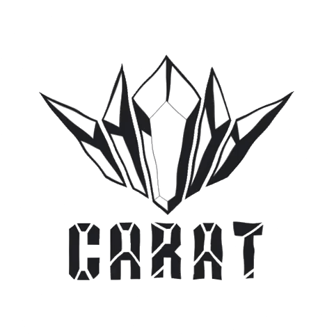

# CARAT

This app allows you to view statistics and information for the top 100 cryptocurrency. The logo and branding is from [CARAT](https://powerrangers.fandom.com/wiki/Caring_And_Radical_Ambitious_Team) a fictional organization from the show [Mashin Sentai Kiramager](https://powerrangers.fandom.com/wiki/Mashin_Sentai_Kiramager). 

## Instructions 

If you want to build yourself follow the instructions below. Otherwise you can view the app here: [CARAT](https://carat-alpha.vercel.app/)

1. Go to [RapidAPI](https://rapidapi.com/) and create an account.
2. Subscribe to the [Coinranking API](https://rapidapi.com/Coinranking/api/coinranking1/) and [Bing News Search API](https://rapidapi.com/microsoft-azure-org-microsoft-cognitive-services/api/bing-news-search1/) and get a key.
3. Create a `.env.local` file in the root directory (where package.json is) and add these (env) variables:
- `REACT_APP_BINGNEWS_KEY=`
- `REACT_APP_COINRANKING_KEY=`
4. Add your keys to the env
5. In the terminal in the directory of the project, type: `npm install`
6. To then run the app, in the terminal, type: `npm start`

